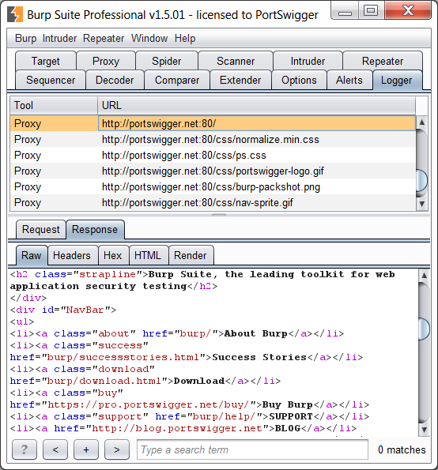

# Sample Burp Suite extension: custom logger

This extension provides something that has often been requested: a suite-wide
HTTP logger within the main Burp UI. It provides a great example of how you can
add some really useful functionality to Burp with a very small amount of code or
effort.

The extension uses the following techniques, which are made possible by the 
[extender API](https://portswigger.net/burp/extender/):
- It creates a custom tab within the main Burp UI, in which to display the
  message log.
- It creates two instances of Burp's own HTTP message editor, in which to
  display the selected request and response (as in the Proxy history).
- It provides an implementation of IMessageEditorController, which the message
  editors can query to obtain additional details about the displayed messages
  (to support context menu actions, etc.).
- It asks Burp to customize its own UI components, in line with Burp's UI style.
- It adds an HTTP listener, to receive details of requests and responses made by
  all Burp tools.
- It uses an extension helper method to analyze the URL in each request.

In approximately 200 lines of fairly simple code, this extension adds a useful
new feature, with all of the fiddly work (handling and rendering of HTTP
messages) being done by Burp itself via the API.

This repository includes source code for Java, Python and Ruby.
